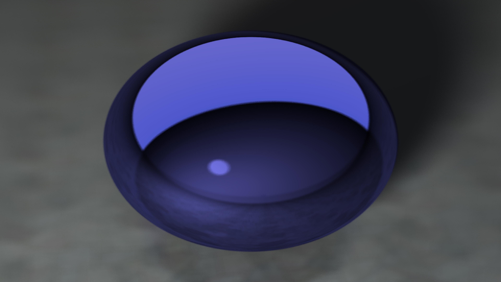
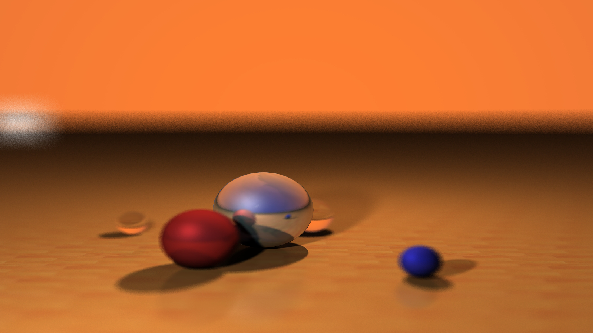
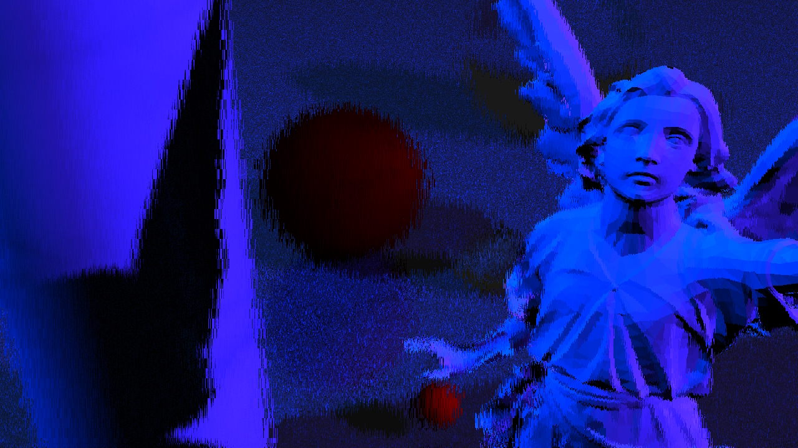
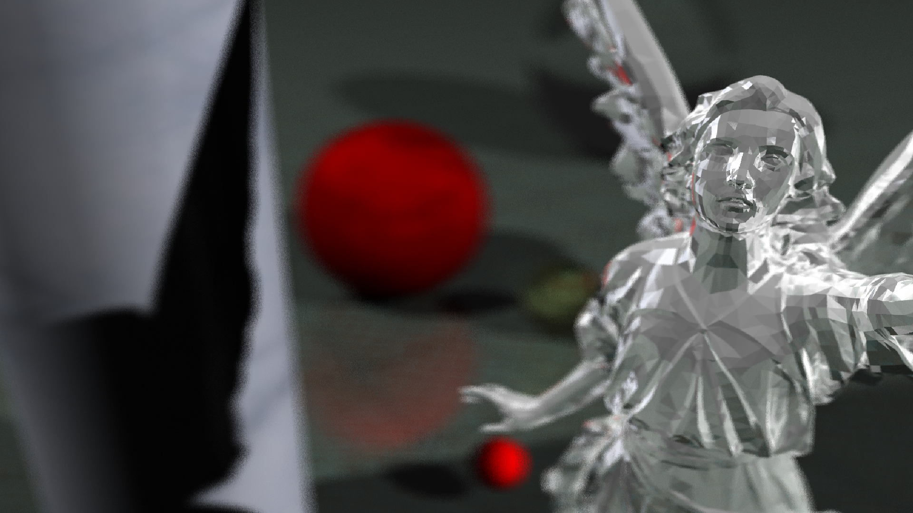
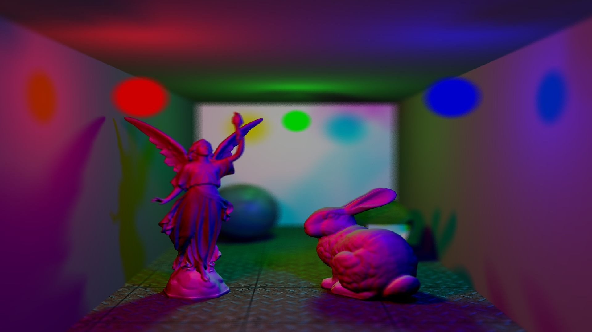
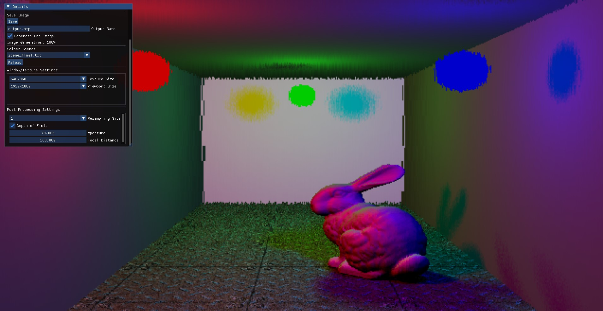

# CUDA Ray Tracing

## Description

This project implements ray tracing using CUDA for computation and OpenGL for rendering. It leverages the `cuda_gl_interop` library provided by Nvidia for efficient data transfer between CUDA and OpenGL. The implementation includes various geometric primitives, bounding volume hierarchy (BVH) for acceleration, and depth of field effects.

> **⚠️ Warning:** This project was intended to be a technical and fast experimentation. The code here does not reflect my full capabilities in terms of code architecture and optimization. I just wanted to spend 5 days learning as much new technical notions as possible.

## Implemented Features

### Geometric Primitives

The project supports various geometric primitives, including:
- Bezier surfaces
- Squares
- Spheres
- Cylinders
- Meshes

### Bounding Volume Hierarchy (BVH)

BVH is an acceleration structure that enhances rendering performance by organizing geometric primitives within a hierarchical tree of bounding volumes. This structure allows the ray tracing algorithm to quickly eliminate large portions of the scene that do not intersect with a given ray, thereby reducing the number of intersection tests required.

### Depth of Field

Depth of field (DoF) is an effect that simulates the focus properties of a camera lens. In ray tracing, DoF is achieved by:
- **Aperture**: The aperture size determines the depth of field; a larger aperture results in a shallower depth of field.
- **Focal Distance**: This is the distance from the camera at which objects are in perfect focus. Rays are sampled within the aperture and focused on the focal plane, creating a natural blur for objects not in focus.

## Screenshots

<table>
  <tr>
    <td>
      
      <div><em>Purple reflective sphere</em>: First test with DOF (Depth of Field) ON and 128 samples, rendered in less than 1s</div>
    </td>
    <td>
      
      <div><em>Orange Scene</em>: Multiple balls rendered with 64 samples & DOF ON rendered in ~8s</div>
    </td>
  </tr>
  <tr>
    <td>
      
      <div><em>Low Quality Purple Statue Scene</em>: Scene with multiple objects and the Stanford Lucy Statue (34k triangles) (1 sample) (1280x720), rendered in ~10s</div>
    </td>
    <td>
      
      <div><em>High Quality Purple Statue Scene</em>: Scene with multiple objects and the Stanford Lucy Statue (34k triangles) (32 samples) (3840x2160), rendered in ~3h</div>
    </td>
  </tr>
    <tr>
    <td>
      
      <div><em>Diffused Crystal Statue Scene</em>: Scene with multiple objects and the Stanford Lucy Statue with crystal like properties mixed with white diffuse color (34k triangles) (32 samples) (1920x1080), rendered in ~1h</div>
    </td>
    <td>
      
      <div><em>Final Scene</em>: Scene with a Stanford Lucy Statue and Stanford Bunny (34k + 70k triangles) (32 samples) (1920x1080), rendered in ~1.5h</div>
    </td>
  </tr>
</table>

## Getting Started

### Prerequisites

- CUDA-capable GPU (I used my own laptop for this project, a RTX 3070 Laptop with Ampere architecture)
- CUDA Toolkit
- OpenGL

### Installation

1. Clone the repository:
   ```sh
   git clone https://github.com/yourusername/CUDA_RayTracing.git
   ```

2. Open the `Visual Studio solution` in `CUDA_RayTracing\CUDA_RayTracing.sln`.

3. Build the solution.

4. Launch `CUDA_RayTracing.exe`.

### User Interaction



- Load scenes from the ImGUI GUI.
- Choose between continuously generating frames or rendering a single image.
- Set depth of field, aperture, and focal distance.
- Take screenshots (GUI is not included in the screenshots).
- Change texture size (number of pixels processed by CUDA).
- Adjust viewport size (window size where the rendered image is displayed).

### Performance Profiling

Use Nvidia NSight Compute for detailed performance analysis and optimization of CUDA kernels.

### Key Features

- **Ray Tracing with CUDA and OpenGL**: Efficient integration using `cuda_gl_interop`.
- **Geometric Primitives**: Supports bezier surfaces, squares, spheres, cylinders, and meshes.
- **Bounding Volume Hierarchy (BVH)**: Optimizes rendering by efficiently managing spatial data.
- **Depth of Field**: Simulates camera focus with adjustable aperture and focal distance.

## Resources

- [CUDA/OpenGL Interoperability Documentation](https://docs.nvidia.com/cuda/cuda-runtime-api/group__CUDART__OPENGL.html)
- [CUDA Architecture Code Matching for different setups](https://arnon.dk/matching-sm-architectures-arch-and-gencode-for-various-nvidia-cards/)
- [Post on how occupancy influences kernel performances](https://stackoverflow.com/questions/6688534/cuda-dependence-of-kernel-performance-on-occupancy)
- [BVH: Bounding Volume Hierarchy](https://en.wikipedia.org/wiki/Bounding_volume_hierarchy)
- [Acceleration Techniques (BVH/Kd-Tree/Octree)](https://www.csie.ntu.edu.tw/~cyy/courses/rendering/15fall/lectures/handouts/chap04_acceleration_4up.pdf)

## Notes

- **Visual Studio Configuration**: Ensure `Properties/Cuda C/C++/Common/Generate Relocatable Device Code` is enabled for external symbol linking.
- **GPU Architecture**: For an RTX 3070 Laptop, use `sm_86` architecture.
- **Thread and Block Configuration**: Utilize a 16x16 thread block size. Calculate the number of blocks as `(width + block_size - 1) / block_size` and `(height + block_size - 1) / block_size`.
- **Performance Profiling**: Use Nvidia NSight Compute for performance profiling.
- **Stack Size Management**: Manage stack size with `cudaDeviceSetLimit(cudaLimitStackSize, N)`.
- **Random Seed Generation**: Ensure unique seeds for each device to avoid correlation in random number generation.
